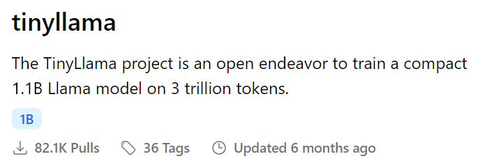

# Modeling with Ollama

## Introduction
This guide provides instructions on how to set up and execute Ollama's models using Docker. Follow the steps outlined below to get started.

### Requirements
- Docker
- Docker compose

### The project

#### Step-by-Step Guide
1. Clone the Repository: First, clone your Git repository that contains the Docker setup and model files.

2. Build and Run the Docker Containers: To start the project, enter the following command in the root of the project: <br> `docker-compose up -d` <br>
Mode Detach (-d): This command runs the containers in the background, allowing you to execute other commands in the terminal.
This will start a Jupyter Lab with all the necessary dependencies to begin working (ollama, pandas..).
Note: Don't forget to `docker-compose down` when you are done.

**Downloading Models**

The API cannot automatically download each model, so after running docker-compose up -d, you need to manually pull each model. For the smallest model, run:
`docker-compose exec ollama ollama pull tinyllama`
If you are creating a new model from a Modelfile, you can do so with the following command:
`docker-compose exec ollama ollama create analyze_tinyllama -f /workspace/modelfile_tinyllama`

https://www.youtube.com/watch?v=DEcP4bkvHG4



3. Access the Services
    - Jupyter Lab: http://localhost:8888. If you are on a remote server, replace localhost with your server's IP address.
    - Visual Studio Code: http://localhost:8080. If you are on a remote server, replace localhost with your server's IP address.

4. View Container Logs: If you need to view the logs of your running containers, use the following commands: 
```
docker-compose logs jupyter
docker-compose logs vscode
```